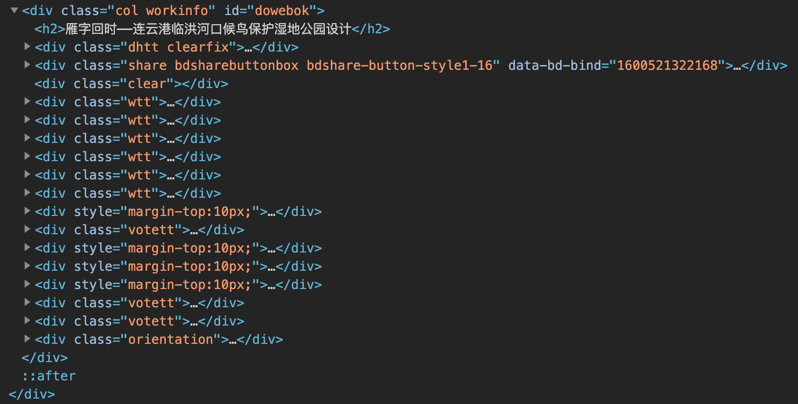

- [第十届艾景奖学生组入围作品投票](https://www.idea-king.org/mobile/tpxs.php?from=timeline)
- [目录 BackupCatalogue](./resource/backupCatalogue.md)

## 参考文章
- [Cheerio - 中文文档](https://github.com/cheeriojs/cheerio/wiki/Chinese-README)
- [Node.js可能是最适合写简易小爬虫的语言，速度极快、代码极少 - 知乎](https://zhuanlan.zhihu.com/p/61583602)
- [node-"fs-extra"模块代替fs使用 - 掘金](https://juejin.im/post/6844903641594216455)
- [node.js简单爬虫扒取妹子图 - 知乎](https://zhuanlan.zhihu.com/p/26556429)
- [jQuery 遍历 - 后代](https://www.runoob.com/jquery/jquery-traversing-descendants.html) *Cheerio类似于jQuery*

## 踩坑总结
- `$().find()`的结果并不是一个数组，再`.get()`以后才是一个数组
- `.find()`是找节点下的所有后代，并不是隔一代的子元素
- `.get()`的参数是 index
- `.text()`是只有用`$()`包裹的对象才可以使用，`.find()`的结果也可以作为其参数
- `.find()`可以使用`.each()`。`.get()`后则不行，因为得到的是一个 Array，但是可以使用原生的`forEach()`

## 翻车报错
```bash
internal/streams/legacy.js:61
      throw er; // Unhandled stream error in pipe.
      ^

Error: getaddrinfo ENOTFOUND www.idea-king.org
    at GetAddrInfoReqWrap.onlookup [as oncomplete] (dns.js:66:26) {
  errno: -3008,
  code: 'ENOTFOUND',
  syscall: 'getaddrinfo',
  hostname: 'www.idea-king.org'
}
```

## 解析思路

- 主要信息都包含在`id="dowebok"`中
- `class="wtt"`：项目的基本属性
    ```html
    <div class="wtt">
        <span class="lb">作品编号：</span>
        ILIA-S-20207840
    </div>
    ```
- `style="margin-top:10px;"`：图片
    ```html
    <div style="margin-top:10px;">
        
        <p style="text-align:center;">总平面图</p>
        <p>
            为了提升候鸟栖息环境质量，恢复濒危候鸟的数量，经过调研后，本方案选址为连云港市临洪河口（全球八条候鸟迁徙路线中有两条经过该处），对此处拟进行候鸟保护湿地公园设计，旨在将因非法开垦鱼塘、开矿导致地质坍塌等人为破坏因素而遭受破坏的临洪河口湿地进行生态修复。在基地设计中充分发挥此处拥有多种湿地类型的特点，并加入红海滩（盐地碱蓬）、芦苇群落等当地特色植物群落区域，通过规划设计以鸟类栖息地营造为目的的城市湿地公园，以期有效地完善并重塑生态多样性从而恢复并提升候鸟数量和种类；与此同时，希望加强人们对湿地公园以及鸟类的了解，丰富人们对自然的体验感，最终创造出人、鸟及自然一体的和谐环境。
        </p>
    </div>
    ```
- `class="votett"`：带\<h2>的文段
    ```html
    <div class="votett">
        <p class="tt">设计说明</p>
        <div>
            鸟类在全球生物多样性体系中占有至关重要的地位，是环境质量的重要评价因子。因此，恢复城市中被生产空间占据的鸟类生态栖息用地具有重要意义，其本身也是城市公园湿地景观规划设计的重要环节。
            为了提升候鸟栖息环境质量，恢复濒危候鸟的数量，经过调研后，本方案选址为连云港市临洪河口（全球八条候鸟迁徙路线中有两条经过该处），对此处拟进行候鸟保护湿地公园设计，旨在将因非法开垦鱼塘、开矿导致地质坍塌等人为破坏因素而遭受破坏的临洪河口湿地进行生态修复。在基地设计中充分发挥此处拥有多种湿地类型的特点，并加入红海滩（盐地碱蓬）、芦苇群落等当地特色植物群落区域，通过规划设计以鸟类栖息地营造为目的的城市湿地公园，以期有效地完善并重塑生态多样性从而恢复并提升候鸟数量和种类；与此同时，希望加强人们对湿地公园以及鸟类的了解，丰富人们对自然的体验感，最终创造出人、鸟及自然一体的和谐环境。
        </div>
    </div>
    ```