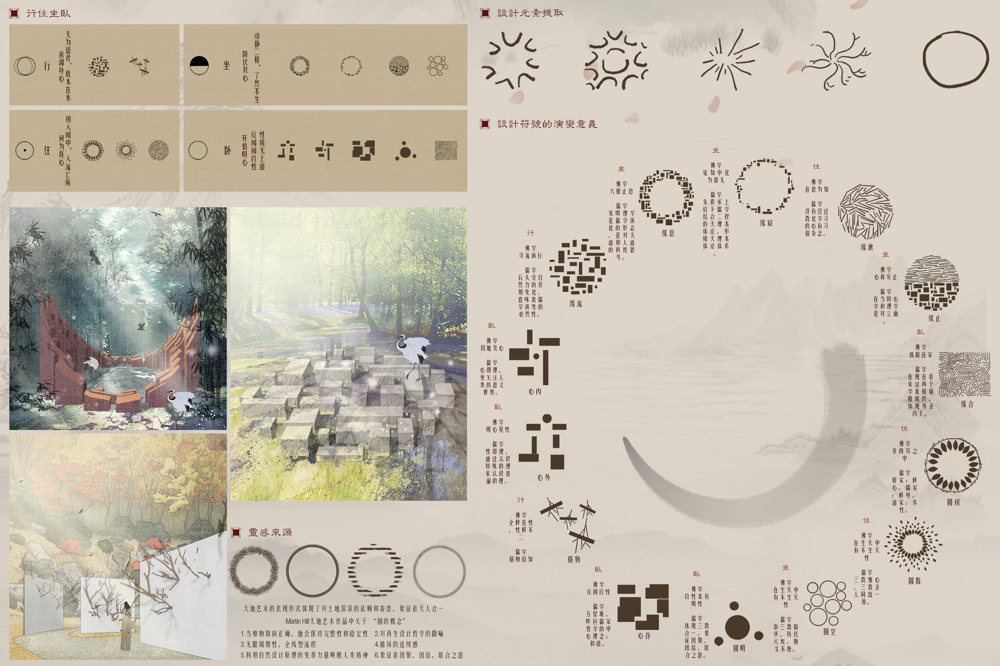

# 终始——白鹿洞书院景观改造 
- **投票数**：3163
- **作品编号**：ILIA-S-20207780
- **申报类别**：方案设计 - 园区景观设计
- **项目名称**：终始——白鹿洞书院景观改造
- **设计时间**：2020-04-11
- **项目地点**：白鹿洞书院
- **项目规模**：3800平方米

平面图设计，和书院前期分析整合。
## 设计说明

白鹿洞书院中古人思想，思想架构融入纪念性景观，以大地艺术的形式表现：亲近自然，接近自然，对这片土地深深的依赖和眷恋。人与动物的最大区别在于：人有历史感。提取对书院和宋明理学有重要影响的三个人：朱熹，陆九渊，王阳明思想关键词：儒学，佛学，顺序性，宋明理学，心学从中提取寻找到设计主题：行住坐卧。根据古代思想架构：三分世界观：三才和谐，二分世界观：天人合一从中发现和大地艺术中哲学的共同点注意到：天，地，人。从大地艺术家Martin Hill的作品中提取圆的概念，融入到设计符号的演变。大地艺术作为西方哲学的体现，在片土地上用大地艺术的形式去完成纪念性景观，是西方哲学和东方哲学的交融，碰撞。再现思想的百家争鸣，百花齐放。从儒学角度解释演变的设计符号，从佛学角度阐释符号到立体的模型形成，设计的中心主题：行住坐卧，也分成了四个阶段完成设计：善调身心，何为真心，降服其心，开悟明心去让行住坐卧的精神和思想更鲜活的表现。对古人思想的纪念传承，历史感的延续......继承传扬这块土地的精神和历史，希望能给这片土地带来新的生机，对这块土地的未来的一种期待。设计愿景：希望通过设计让这块土地赋予新的活力，让思想和精神被纪念被传承，也是对书院今后的发展一个美好愿景和一种可能性。希望书院迎来它适应现在社会的重要转向。

效果图设计，古人思想分析（朱熹，王阳明，陆九渊）总结出行住坐卧作为设计主线。

效果图设计，每个来书院的人被当作修行的人希望他们看到大地艺术作品会有和历史交汇的感觉，看到都能有所启发。分析古代思想架构。

效果图设计，设计元素提取和设计参考灵感，对设计元素演变的佛学解释和儒学解释每个设计元素都和对应的效果图挂钩。
## 设计感悟

这个项目的特别在于用哲学的手法表达了纪念性景观，给纪念性景观赋予了思想。把东方书院的古人思想哲学和西方大地艺术哲学的具象化表现所结合，纪念性景观纪念的不只是人也是一种思想一种境界，是在对历史的一种致敬，人和动物最大的区别在于人有历史感。
## 设计亮点

这份作品的设计上是将东方哲学和西方哲学所结合的纪念性景观，从设计元素的提取，到设计元素的演变运用到宋明理学去阐释，设计元素就是每个节点的平面图只是以平面构成形式表达。设计元素的生成演变运用到佛学去解释，宋明理学和佛学的共同点指向行住坐卧这条设计主线。
