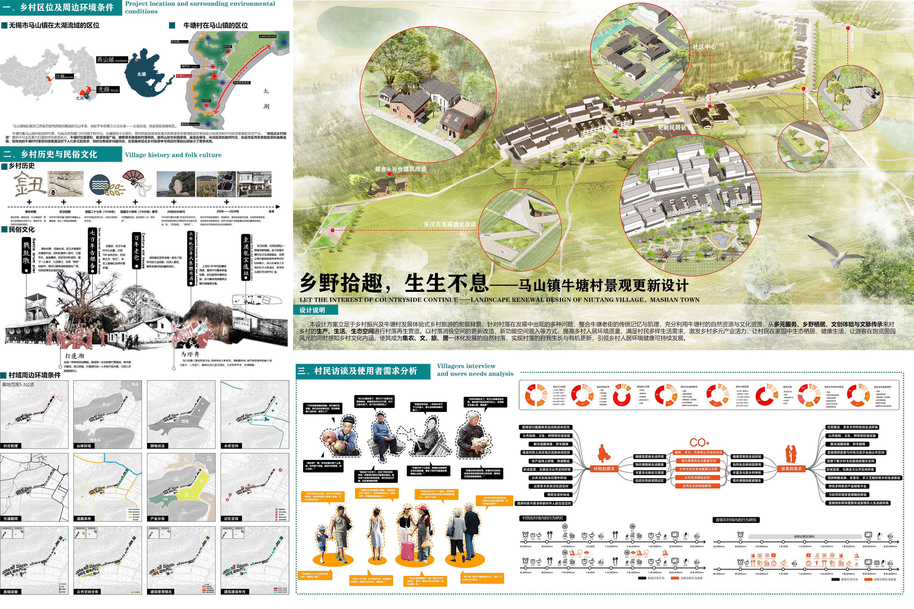

# 乡野拾趣，生生不息——马山镇牛塘村景观更新设计 
- **投票数**：1100
- **作品编号**：ILIA-S-20207810
- **申报类别**：方案设计 - 旅游区规划
- **项目名称**：乡野拾趣，生生不息——马山镇牛塘村景观更新设计
- **设计时间**：2020-06-01
- **项目地点**：江苏省无锡市
- **项目规模**：5.3公顷

本设计方案立足于乡村振兴及牛塘村发展体验式乡村旅游的宏观背景，针对村落在发展中出现的多种问题，整合牛塘老街的传统记忆与肌理，充分利用牛塘村的自然资源与文化资源，从多元服务、乡野栖居、文创体验与文脉传承来对乡村的生产、生活、生态空间进行村落再生营造。以村落消极空间的更新改造、新功能空间置入等方式，提高乡村人居环境质量、满足村民多样生活需求、激发乡村多元产业活力，让村民在家园中生态栖居、健康生活，让游客在饱览田园风光的同时感知乡村文化内涵，使其成为集农、文、旅、居一体化发展的自然村落，实现村落的自我生长与有机更新，引领乡村人居环境健康可持续发展。
## 设计说明

乡村振兴政策背景下，本课题以无锡市马山镇牛塘村为研究对象，对乡村人居环境空间展开研究。在调研过程中，发现乡村人居环境出现这样或那样的“病症”，如：大量存在消极的公共空间、道路阻塞局促、生活配套服务不足、文化记忆空间衰败、民俗文化被遗弃、乡村产业活力不足等，由此可以看到乡村人居环境空间所呈现的“亚健康”状态。如何让乡村聚落重新焕发活力，停止颓势迈向健康的发展方向是本课题探讨的重要内容。
牛塘村地处在无锡太湖国家旅游度假区，拥有得天独厚区位优势和自然资源。同时，村落内部遗存的东汉龙窑遗址、战鼓墩、700年的古银杏以及上世纪八十年代集体使用的“猪舍谷仓”都承载着不同时代的记忆，是牛塘村宝贵的文化资源。本方案充分利用牛塘村的自然资源与文化资源，从多元服务、乡野栖居、文创体验与文脉传承来对乡村的生产、生活、生态空间进行村落再生营造。以村落消极空间的更新改造、新功能空间置入等方式，提高乡村人居环境质量、满足村民生活生产需求、激发乡村多元产业活力，让村民在家园中生态栖居、健康生活，游客在饱览田园风光的同时感知乡村文化内涵，使其成为集农、文、旅、居一体化发展的村落，引领乡村人居环境健康可持续发展。

根据牛塘村的调研问题总结提出：多元服务、乡野栖居、文创体验与文脉传承的设计策略。
多元服务：根据人群需求，通过新功能的注入、空间的新建与更新，提供多样设施与服务，提供就业岗位；丰富人的空间体验，满足时下人的多元需求。
乡野栖居：优化村落原有空间与流线，在留住乡愁的基础上更新居民区，依托村庄自然人文资源，推动民宿产业发展。
文创体验&文脉传承：挖掘村落中的特色历史文化记忆节点，围绕空间节点进行村落营造，强化空间的文化传达性与体验性，活化历史记忆。
改善乡村景观完善乡村生态服务系统，与乡村民宿、文化体验馆、采摘园、乡村特色农产品等结合起来，提供乡村独特的旅游体验，促进全域旅游的发展。
设计生成步骤如下：
一、重拾链接村落历史人文记忆场所：挖掘村中历史人文记忆场所与特色空间，以传承传统肌理与记忆，挖掘村落文化内涵，激活村落活力为出发点，围绕各空间节点进行村落营造，将其作为村庄发展的活力源泉与特色展示窗口。
二、注入新功能，激发新活力：围绕村落空间节点，深入挖掘村落文化内涵，通过新功能的注入，进行空间的更新与新建，满足居民与游客时下的多元需求，在村落内部以此激活结点活力形成多个活力区。
三、织补肌理，村落营造：梳理村落空间流线，织补村落肌理。在村落内部形成独特的村落慢行网络，营造村落内自然生态的空间环境与巷野体验，并在村落内部形成空间节点的串联。
四、新旧交融共生：通过村落营造，实现新与旧的融合共生，在村中形成多个活力圈，使历史人文场所与特色空间焕发新的活力，激活整个村落，助力生态乡村旅游与乡村振兴。

“多元服务”——社区中心规划设计。
“乡野栖居”——牛塘村生活区更新设计 。

“文创体验”——猪舍&谷仓旧址改造设计。
“文脉传承”——东汉古龙窑遗址改造设计。
## 设计感悟

课题从生活、生产、生态多维度思考乡村人居环境健康可持续的发展方向，发现并总结了乡村人居环境的“病症”，并以多元服务、乡野栖居、文创体验、文脉传承来开出“药方”：完善乡村生活配套服务、优化乡村人居生活环境、活化历史记忆场所、挖掘文化遗产脉络 ，从而达到激发乡村活力，引领乡村人居环境健康可持续发展。
## 设计亮点

本方案针对牛塘村村落发展过程及居民生活中出现的多样问题，充分利用牛塘村的自然资源与文化资源，从多元服务、乡野栖居、文创体验与文脉传承来对乡村的生产、生活、生态空间进行村落激活营造。以村落消极空间的更新改造、新功能空间置入等方式，提高乡村人居环境质量、满足村民生活生产需求、激发乡村多元产业活力，让村民在家园中生态栖居、健康生活，游客在饱览田园风光的同时感知乡村文化内涵，使其成为集农、文、旅、居一体化发展的村落，引领乡村人居环境健康可持续发展。
