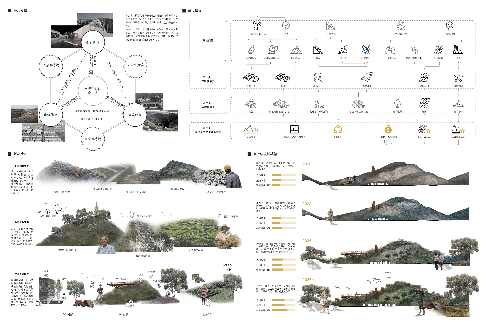

# 矿地重生-衢州市宋畈乡矿山景观修复与更新 
- **投票数**：2333
- **作品编号**：ILIA-S-20207868
- **申报类别**：方案设计 - 城乡公共空间
- **项目名称**：矿地重生-衢州市宋畈乡矿山景观修复与更新
- **设计时间**：2020-08-11
- **项目地点**：浙江衢州宋畈乡
- **项目规模**：43.53平方千米

基于对浙江省衢州市常山县宋畈乡发展历史和场地现状的深入研究，分析总结其现存亟待解决的问题主要有地质破坏、空气污染、生态破坏、资源浪费。并结合总平面图及总平分析图做出设计前后用地功能的对比。
## 设计说明

基于对浙江省衢州市常山县宋畈乡发展历史和场地现状的深入研究，分析总结其现存亟待解决的问题有地质破坏、空气污染、生态破坏、资源浪费等，本设计针对区内现有的主要问题，提出侧重于注重资源、环境和景观的可持续的设计概念。以矿山综合整治为切入点，从地质环境、资源利用、和景观提升三个角度着手，力求在满足生态环境自我更新及发展的同时，提升乡村景观、引领健康生活，实现多种产业并行发展，达到经济、生态和文化的共赢。
设计目标及解决策略如下：
（1）转变用地形态，优化用地结构，增加交通可达性
调整宋畈乡土地资源利用不合理、结构得不到优化的空间布局问题，利用景观手段，基于现有的用地特点和发展的可能性，制定了用地布局和转化的方式。依据现有基质完善区内交通线及矿山特色景色，提升矿区环境质量。
（2）解决生态问题，重塑地区景观，共建美丽乡村
通过治理修复矿山基质、营造绿色生态的农业景观、创造亲水景观带等手段重塑矿区景观，在解决由矿山的开发所遗留的生态问题的同时也能够营造良好的景观效果。
（3）多产业共同发展，实现经济环境可持续发展。
通过景观发展带动经济转型，使得农、工、旅三大产业比重发生改变的同时，也可以满足当地经济条件发展，实现效益最大化。

针对区内现有的主要问题，提出侧重于注重资源、环境和景观的可持续的设计概念。以矿山综合整治为切入点，从地质环境、资源利用、和景观提升三个角度着手，力求在满足生态环境自我更新及发展的同时，提升乡村景观、引领健康生活，实现多种产业并行发展，达到经济、生态和文化的共赢。

矿山综合整治：根据常山矿区废弃地的地形特点，将可生态修复的矿区分为4种类型，进行分类治理。
矿山垃圾回收利用：积极管理和回收由矿山开发产生的建筑垃圾，将它们用于土壤改良、山体修复，以及转化为景观、住房外部建材。
生态景观完善：完善场地的生态景观，包括提升河道景观、改善农业景观和恢复矿山生态景观。
营造多样化的矿山旅游休闲场地，依据现存矿山不同的地形和机理状况，开发形成山地游乐场、半山隧洞、工业体验、立窑攀岩等多样活动场所。

河道景观：清淤疏通场地内的两条水系，对驳岸进行修整改造，并构建水体净化系统，利用地形营造跌水景观，以增加水中的含氧量，起到生态修复和水质净化作用；滨水植物采用乔-草两个层级的植物组团，岸堤选用耐水湿、耐盐碱以及能够吸收有害气体的乔木，河道及水岸配置草本花卉植物和净水植物，形成自然、野趣的植物群落景观。同时提升滨水景观的质量，提供人们休憩活动的场所。
农业景观：将坡度较陡区废弃地梯田化改造，与现有水田、梯田资源搭配，打造拥有农田果园、花卉苗圃的休闲农业全产业链。在恢复矿山基质和利用现有梯田肌理的基础上，选择优良的蜜源植物和本土经济作物，通过成立采摘体验园等，促进当地休闲农业发展。
矿山景观：对矿山进行综合整治，保留部分矿山肌理的原貌，部分实现生态复绿，提升生态价值和环境质量，并为人们提供多角度欣赏矿山的可能性，达到环境教育意义。矿山修复采用藤本植物起到固土护坡和固氮等功能；选用耐盐碱并能够滞留和吸附空气中的粉尘、颗粒物以及二氧化硫、氯气等有害气体的乔木和灌木，改善矿区空气质量。
## 设计感悟

本项目立足于改善乡村的生态环境条件,满足乡村居民对美好生活的需求，以矿山综合整治为切入点，从地质环境、资源利用、和景观提升三个角度着手，在满足生态环境自我更新及发展的同时，发展多产业并行，利用可持续化的手段，重塑地区景观，引领健康生活。
## 设计亮点

随着社会结构转型，景观也逐步展现出不同的面貌。改建，要在现有的基础上反映出当代社会的变化与需求，让其冲击性地暴露，再赋予空间新的含义，使得原有的部分为乡村生活带来新的惊喜和趣味。作品基于宋畈乡实际情况，充分考虑其作为矿区的自身情况，在适当保留原有矿山与农业基质的基础上，立足于多样性景观设计,力求提升乡村景观类型,以推动营建立足乡土社会、富有地域特色、承载田园乡愁的美丽健康家园。
