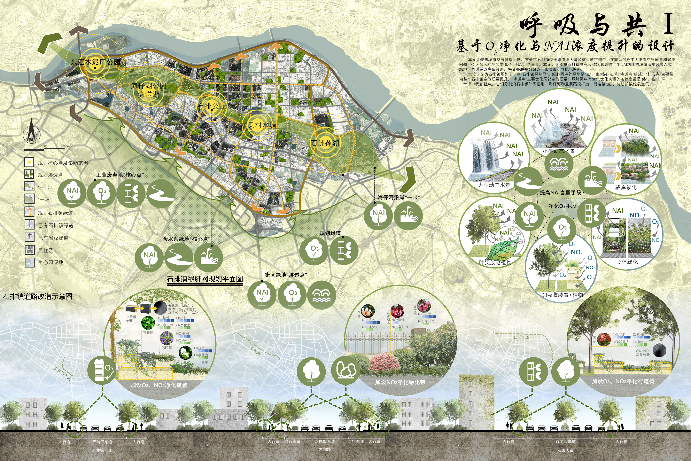

# 呼吸与共—基于O₃净化与NAI浓度提升的设计 
- **投票数**：1262
- **作品编号**：ILIA-S-20208002
- **申报类别**：方案设计 - 城乡公共空间
- **项目名称**：呼吸与共—基于O₃净化与NAI浓度提升的设计
- **设计时间**：2020-06-01
- **项目地点**：东莞市石排镇
- **项目规模**：石排镇:4872 hm² 东江水泥厂:32.9 hm²

## 设计说明

本设计聚焦城市空气健康问题。东莞市石排镇位于粤港澳大湾区核心城市群中，在转型过程中面临着空气质量和健康问题：O₃污染和空气负氧离子（NAI）含量低。本设计试图重点打造具有吸收O₃和高效产生NAI功能的城镇密集区嵌入式绿地，同时辅以多条线路，将其关联并组织成一张城市空气优化网络。
本设计先为石排镇规划了一张“石排镇绿肺网”。绿肺网中的绿地是“点”，由“核心点”和“渗透点”组成，“核心点”主要带动整个石排镇空气质量提升，“渗透点”主要优化局部空气质量；绿肺网中有空气优化功能的条状地带是“线”，由“一环”、“一带”和“绿道”组成，它们分别沿石排镇外围湿地、海仔河和重要路段打造，能连接“点”并协助扩散优质空气。
本小组选取“绿肺网”中重要“核心点”东江水泥厂作为空气优化的示范点。首先根据场地O₃污染情况布置O₃净化装置，解决空气污染问题；然后根据地形、降雨等因素设计了一条贯穿全园的从集水、汇流、存储到形成NAI发生节点的水流路线，搭配以植物，提高场地NAI产量。将废弃的东江水泥厂打造成一个服务周边居民与游客、供人们运动休闲、能够进行科普教育、具有生态效益的公园。同时，该场地从产生工业废气到产生优质空气回馈周边的转换，从经济的象征转变为生态的象征，也呼应了东莞从工业城市到生态都市的转型。

 本设计选取“绿肺网”中重要“核心点”东江水泥厂作为空气优化的示范点。首先根据场地O₃污染情况布置O₃净化装置，解决空气污染问题；然后根据地形、降雨等因素设计了一条贯穿全园的从集水、汇流、存储到形成NAI发生节点的水流路线，搭配以植物，提高场地NAI产量。将废弃的东江水泥厂打造成一个服务周边居民与游客、供人们运动休闲、能够进行科普教育、具有生态效益的公园。同时，该场地从产生工业废气到产生优质空气回馈周边的转换，从经济的象征转变为生态的象征，也呼应了东莞从工业城市到生态都市的转型。

 该页面展示了分别对东莞石排镇和石排镇绿肺网示范点（东江水泥厂）进行的前期分析，以及制定的相应设计策略。
首先，分析造成石排镇空气质量问题的O₃的来源及危害，分析石排镇不同区域NAI浓度及NAI不足的危害，并探究NAI生成方式及NAI浓度高的环境特征，明确了石排镇空气质量的问题所在，并为其空气优化寻找突破口和解决思路：采用6种手段分别从减少O₃和提升NAI浓度两方面出发。随后，根据以上结论，并结合石排镇O₃污染区域和NAI供求区域关系分析，提出设计“石排镇绿肺网”的解决方案并具体化，细化整体设计策略，实现石排镇空气健康。
接着，根据对东江水泥厂地块的历史沿革、区位及周边情况分析，确定其作为“石排镇绿肺网”中的一个“核心点”，并明确其作为东莞发展的缩影，在和东莞城市一起从工业向生态转型一事上具有重要意义。因此选定它作为绿肺网“核心点”的示范点进行深入设计。随后，对该地块受周边影响的内部O₃污染情况、内部现有建筑情况进行分析，同时结合其周边地块情况和人群分析，制定相应的设计策略，将废弃的水泥厂地块打造成一个具有生态效益、服务周边居民和游客、能够进行科普教育的公园。

 该页面主要以剖透图的形式展示东江水泥厂公园关键设施及空间的设计。对于工业废弃建筑，本方案保留了可再利用的建筑，提出增设集水系统与垂直绿化结构的概念，增加NAI的产量，并在建筑内部增设活动，形成独特的工业文化景观。在场地中受臭氧污染影响的位置，设置了以O₃净化墙围合而形成的六边形空间，该空间具有净化O₃的生态功能，仅工作人员可进入。在场地其他区域重现了O₃净化装置，供游人进行科普学习，并考虑了吸收O₃植物的花期与科普墙的设计，增强游人的感受体验。瀑布NAI发生区是一个下层空间，一端瀑布与空气摩擦产生大量的NAI，另一端是供游人进入及休憩的大台阶，人们在空间中部进行有氧活动，增强体质。该发生区具有一套完整的水循环系统。
## 设计感悟

本项目关注城市化进程中普遍性问题——空气质量问题，契合竞赛主题。通过严谨地前期分析，把握主要矛盾，聚焦臭氧与负氧离子两个评价指标，形成一套完整的设计逻辑。设计方案完善，既有城镇层面的规划设计，也有具体地块的改造展示，清晰地表达了解决方法。且本项目具有推广性，能为其他城市群解决空气问题提供新思路。
## 设计亮点

1. 本项目了关注城市化进程中普遍性问题——空气质量问题，且设计方案具有推广性，能为其他城市群解决空气问题提供新思路。
2.本项目从城镇规划层面出发，重点打造特殊的城镇密集区嵌入式绿地，它们具有吸收臭氧和高效产生负氧离子的能力，同时辅以多条线路，将其关联并组织成一张城市空气优化网络，以优化整个城镇的空气。
3.本项目具体展示了空气优化网络中“点”和“线”的设计思路，即道路改造与核心点示范等，解决思路清晰具体且具有说服力。
4.本项目提出了一种吸收臭氧的装置与一套增加负氧离子产量的空间设计。
