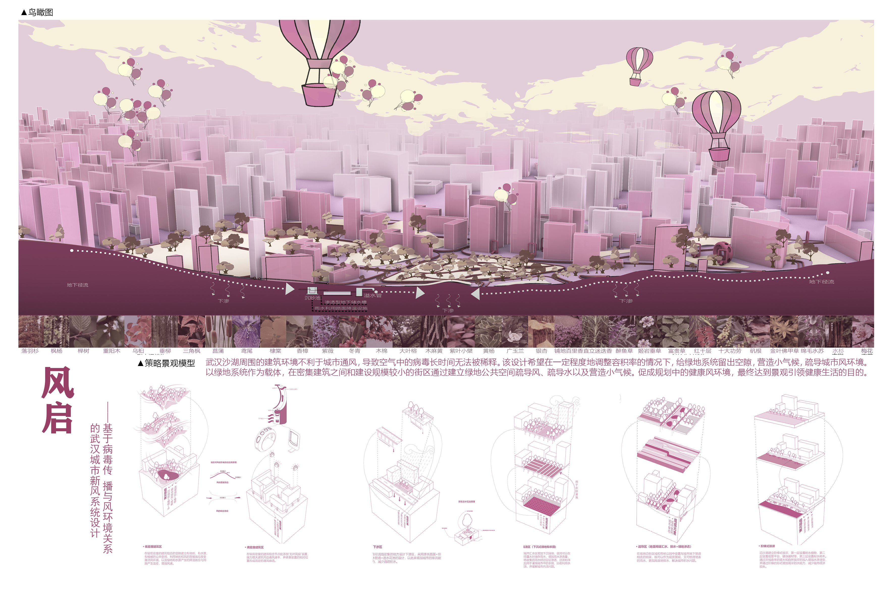
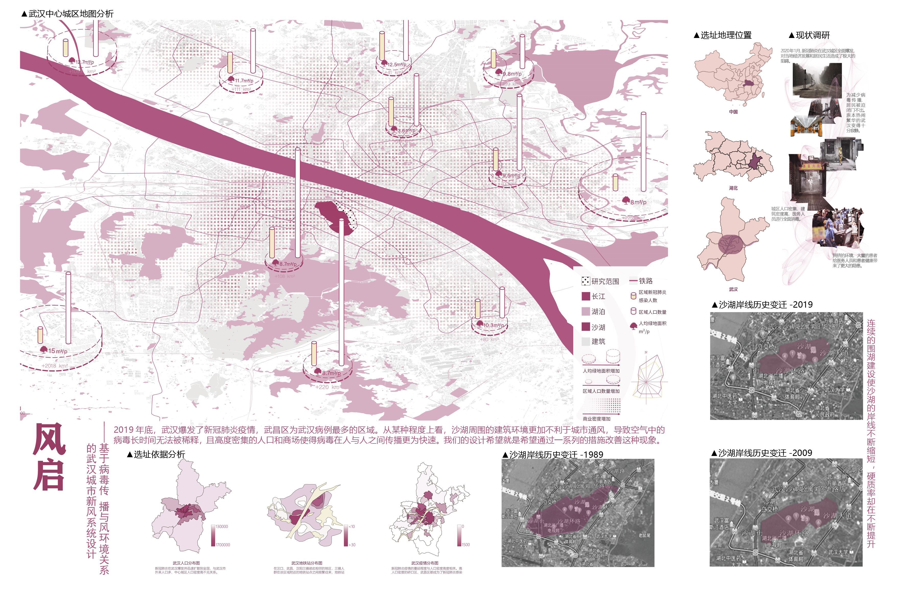
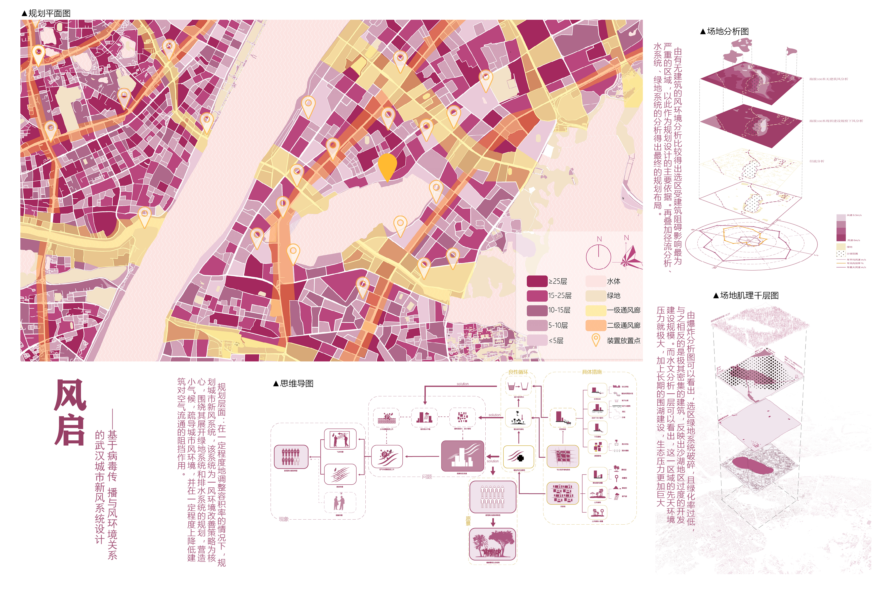
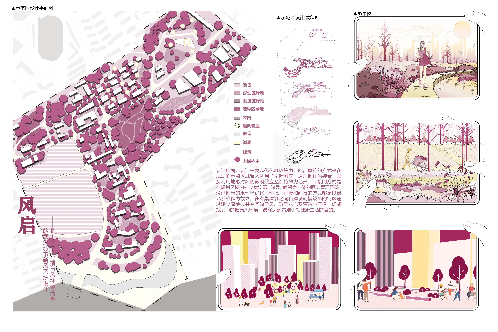

# 风启——基于病毒传播与风环境关系的武汉城市新风系统设计 
- **投票数**：3308
- **作品编号**：ILIA-S-20208295
- **申报类别**：方案设计 - 绿地系统规划
- **项目名称**：风启——基于病毒传播与风环境关系的武汉城市新风系统设计
- **设计时间**：2020-07-07
- **项目地点**：中国湖北省武汉市
- **项目规模**：600hm²

这一部分的表现形式采用极为精简的景观模型，用图形化语言解释清楚了策略原理与方法；鸟瞰图的场景渲染十分吸引人。
## 设计说明

背景：2019年底，武汉爆发了新冠肺炎疫情，武昌区为武汉病例最多的区域。从某种程度上看，沙湖周围的建筑环境更加不利于城市通风，导致空气中的病毒长时间无法被稀释，且高度密集的人口和商场使得病毒在人与人之间传播更为快速。
规划层面：在一定程度地调整容积率的情况下，给绿地系统留出一定的空隙，营造小气候，疏导城市风环境，也就是在一定程度上降低建筑对空气流通的阻挡作用。
设计层面：设计主要以优化风环境为目的。直接的方式是在规划的重点区域置入利用“无叶风扇”原理制作的装置，以及利用地形对风的影响效应塑造特殊微地形；间接的方式是在规划区域内建立集渗透、疏导、截留为一体的雨洪管理系统，通过健康的水环境优化风环境。直接和间接的方式都是以绿地系统作为载体，在密集建筑之间和建设规模较小的街区通过建立绿地公共空间疏导风、疏导水以及营造小气候，促成规划中的健康风环境，最终达到景观引领健康生活的目的。

地图分析的图面表达将病例与人口数据表达为具有对比关系的柱状图，叠加了渐变网格以表现商业密度的分布；将现状的调研结果用拼贴的方式，叙事的手法讲述；运用计算机技术提取了历史地图。

运用计算机技术模拟分析了设计场地的风环境、径流线等，使规划与设计均建立在相关部门的研究结果和科学的模拟分析上；将设计思路转化为更为直观的图面形式——icon+文字

图面表达风格突出，并运用了“独特视角”、“剖透视结合”、“物化看不见的风”等方式实现创新。
## 设计感悟

1.与时俱进。关注当下热点问题——新冠肺炎疫情。
2.深度剖析。将新冠病毒的传播与城市的风环境联系。
3.实事求是。整个项目建立在相关部门的研究结果和科学的模拟分析基础上。
4.以小见大。思路和方法对其他有相似问题的地区的改造具有一定的借鉴意义。
5.发展创新。 对景观规划设计的图面表达方式和问题的解决方法进行了创新。
## 设计亮点

1. 地图分析的图面表达——将病例与人口数据表达为具有对比关系的柱状图，叠加了渐变网格以表现商业密度的分布
2. 将新冠病毒的传播与城市的风环境连接，认识到城市建设规模和绿地系统的建设以及水环境的健康对风环境的影响与关系，在解决风环境问题的同时对水环境压力进行了一定程度的缓解。
3. 运用计算机技术模拟分析了设计场地的风环境、径流线等，并模拟了假设场地没有建设时风环境在地面上的分布，通过“对比”找到风被城市建设堵塞最为严重的区域，以作为规划设计改造重点。整个项目的规划与设计均建立在相关部门的研究结果和科学的模拟分析上，并结合设计师的专业能力进行整合与优化，避免了主观臆测的设计方式带来的弊端。
4. 规划与设计并存。在城市疫情最为严重的区域进行针对性的规划，并在划定的示范区做设计层面的详细指导。且规划设计的思路和方法对其他地区的改造具有一定的普适和借鉴意义。
5. 图面表达风格突出，并运用了“独特视角”、“剖透视结合”、“物化看不见的风”等方式实现创新。
