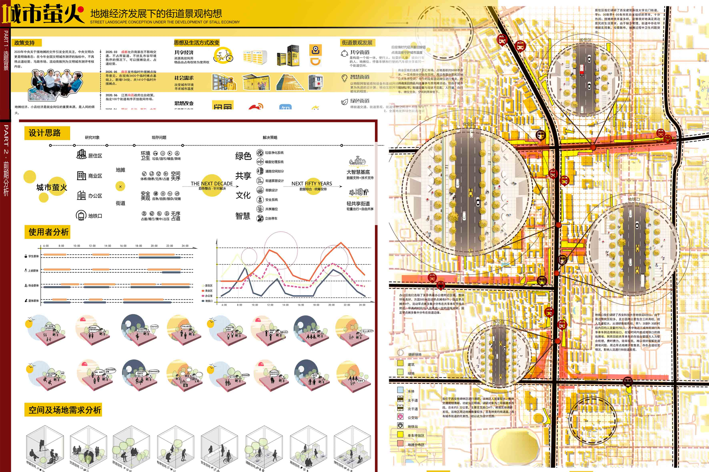
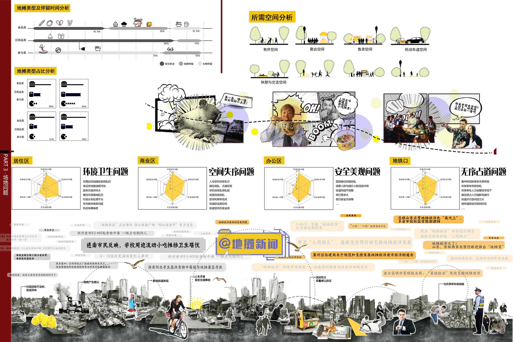
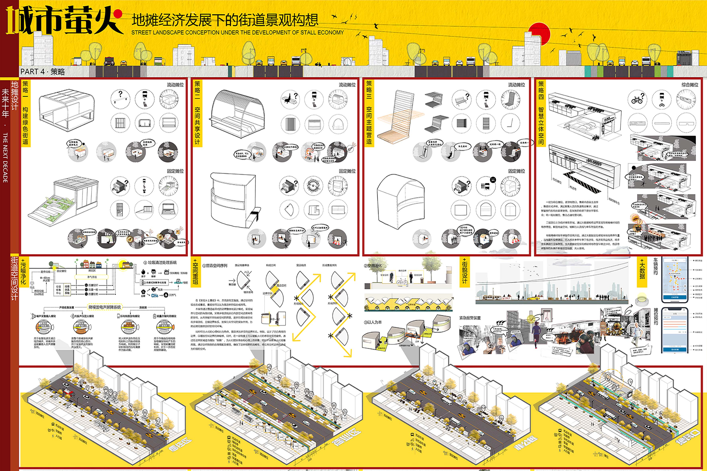
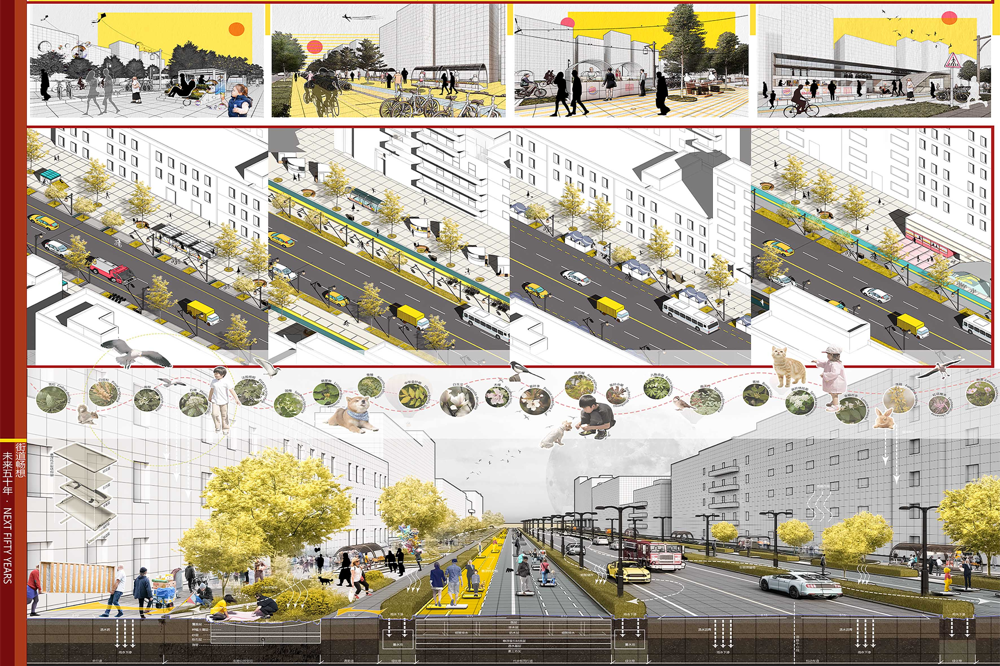

# 城市萤火——地摊经济发展下的街道景观构想 
- **投票数**：1702
- **作品编号**：ILIA-S-20208382
- **申报类别**：方案设计 - 城乡公共空间
- **项目名称**：城市萤火——地摊经济发展下的街道景观构想
- **设计时间**：2020-08-16
- **项目地点**：陕西西安
- **项目规模**：22km2
## 设计说明

最近热火朝天进行的地摊经济给予了我们设计灵感，结合共享生活方式和未来街道的发展趋势，我们构想了一种未来地摊融入街道的街道景观。
我们对地摊的概念定位为“城市萤火”，它是我们每个人都曾沾染的烟火气，也是温暖每个在快节奏城市生活中努力奋斗者的光芒。
项目位于陕西西安雁塔区，经过现场调研，我们选取了地摊分布最为密集的四个功能区中的街道作为研究对象，分别为居住区、商业区、办公区和地铁口旁的主要道路；并各自选取最具有代表性的场地问题，包括环境卫生问题、空间失序问题、安全美观问题和无序停车占道问题；结合地摊设计和街道设计，在近十年的时间维度内给出我们的策略：通过构建绿色街道、设计共享空间、营造空间主题、营造智慧立体空间，更新未来地摊形式，通过地摊结合新材料、新技术，并进行街道空间重组，更好的解决场地现有问题、营造更加绿色、共享、文化、智慧的街道景观。此外，方案还进行了未来五十年之后的街道畅想：悬浮代步板成为新的出行工具，道路灰色面积占比减少，地摊保留社交属性，与街旁绿地结合，成为更加舒适宜人的共享空间，用地摊守护城市温度。

## 设计感悟

1、项目结合当下时事热点，取材新颖，具有现实意义。
2、方案内容具有参考价值和前瞻性，既对现在地摊街道现状提供务实策略，也对未来地摊街道发展进行创意畅想。
3、图面表达明快清晰，逻辑通顺，图纸丰富。
## 设计亮点

1、选题结合当下时事热点，取材新颖，具有现实意义。
最近热火朝天进行的地摊经济给予了我们设计灵感，我们对地摊的概念定位为“城市萤火”，它是我们每个人都曾沾染的烟火气，也是温暖每个在快节奏城市生活中努力奋斗者的光芒。因此我们结合共享生活方式和未来街道的发展趋势，基于街道现状，构想了一种未来地摊融入街道的街道景观，为日后地摊和街道的发展提供可能。
2、方案内容具有参考价值和前瞻性，既对现在地摊街道现状提供务实策略，也对未来地摊街道发展进行创意畅想。
地摊其本质是交流和共享，这两种需求目前是不会消失的，因此我们通过近和远两个时间维度去思考未来地摊与城市街道的关系。近期通过更新未来地摊形式，将地摊结合新材料、新技术，并进行街道空间重组，更好的解决场地现有问题、营造更加绿色、共享、文化、智慧的街道景观；提出远期可能存在的新街道模式：悬浮代步板成为新的出行工具，道路灰色面积占比减少，地摊保留社交属性，与街旁绿地结合，成为更加舒适宜人的共享空间，延续地摊精神，把烟火气留在城市，用地摊守护城市温度。
