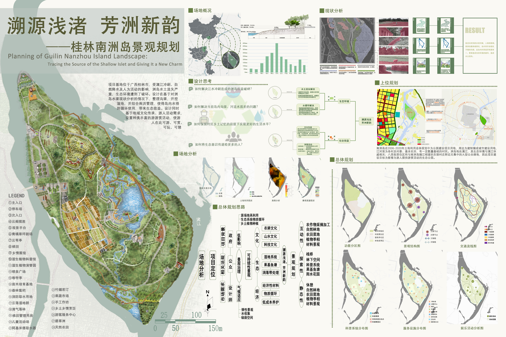
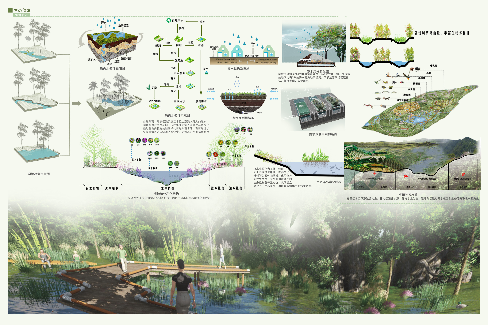

# 溯源浅渚，芳洲新韵——桂林南洲岛景观规划 
- **投票数**：1456
- **作品编号**：ILIA-S-20208479
- **申报类别**：方案设计 - 公园与花园设计
- **项目名称**：溯源浅渚，芳洲新韵——桂林南洲岛景观规划
- **设计时间**：2020-07-10
- **项目地点**：广西桂林
- **项目规模**：67.75HA
## 设计说明

项目基地位于广西桂林市，受漓江冲刷、自然降水及人为活动的影响，洲岛水土流失严重，生态环境遭到破坏。设计在基于对洲岛水渠现状分析的情况下，整理沟渠，开挖湿地，并结合雨洪管理，从自然降水和江水冲刷进入洲岛的水流经过透水铺装、雨水花园等渗透性结构到达园内湿地部分，使得岛内水层级净化，并达到循环使用的效果，为洲岛带来生态效益。设计同时考虑了地域文化传承，通过静态性、探索性、互动性的景观设置，不仅唤起了游人的乡土记忆，引起情感共鸣，也增强公园地域性特征。基于公园人群需求及上位规划，园内设置娱乐、科普两大系统活动，满足游人活动需求，使游人在此可游、可赏、可玩、可憩。

整理沟渠，开挖湿地，并结合雨洪管理，从自然降水和江水冲刷进入洲岛的水流经过透水铺装、雨水花园等渗透性结构到达园内湿地部分，使得岛内水层级净化，并达到循环使用的效果，为洲岛带来生态效益

结合地域文化，通过科普系统与娱乐系统延续农耕文化、山水文化、科技文化，并设置相关活动项目，唤起游人乡土记忆
## 设计感悟

项目地处广西桂林市，城市为山水所环绕，风景秀美旖旎充满自然趣味，项目依靠优越的自然条件和所处的城市环境，以追溯自然野趣意味，更新景观质量为目标进行生态公园设计，助力桂林“公园城市”的营建。
## 设计亮点

1.设计在基于对洲岛水渠现状分析的情况下，整理沟渠，开挖湿地，并结合雨洪管理，从自然降水和江水冲刷进入洲岛的水流经过透水铺装、雨水花园等渗透性结构到达园内湿地部分，使得岛内水层级净化，并达到循环使用的效果，为洲岛带来生态效益。
2.结合地域文化，通过科普系统与娱乐系统延续农耕文化、山水文化、科技文化，并设置相关活动项目，唤起游人乡土记忆。
