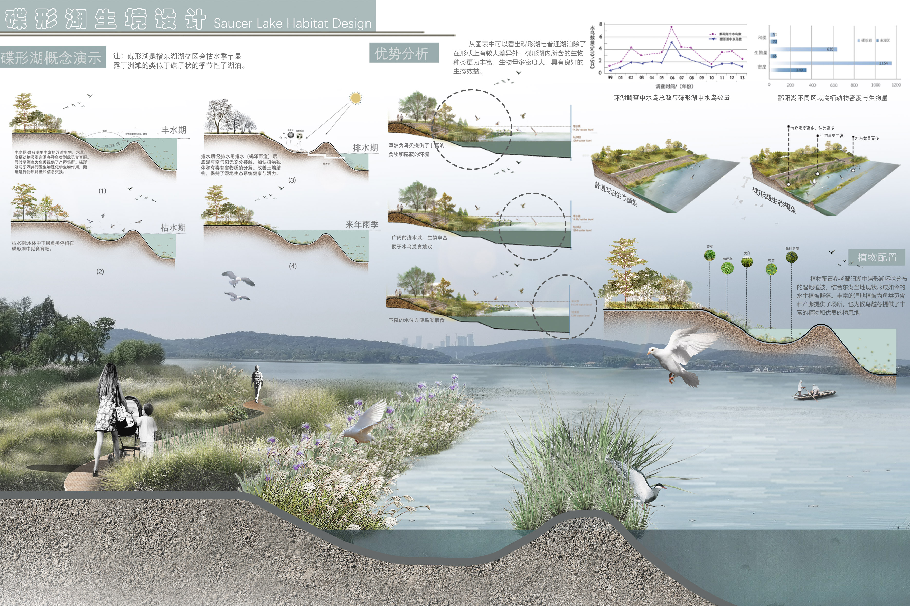
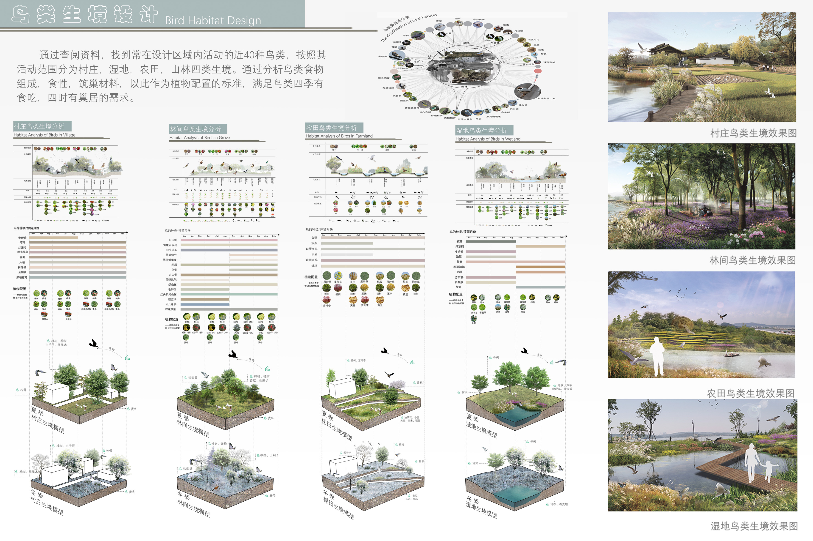

# 生生不息——武汉万国公园生态改造 
- **投票数**：1100
- **作品编号**：ILIA-S-20208491
- **申报类别**：方案设计 - 园区景观设计
- **项目名称**：生生不息——武汉万国公园生态改造
- **设计时间**：2020-08-18
- **项目地点**：湖北省武汉市
- **项目规模**：100ha
## 设计说明

近年来，随着城市扩张、绿地减少，气温升高等生态问题的产生，使“物候不匹配”现象更加频繁，这意味着候鸟的迁徙与植物的开花不再一致，鸟类在迁徙途中将没有果腹的食物。同时气候变化导致温度的升高和降雨量的增加超出了大黄蜂的承受能力，大黄蜂的数量逐年变少，依赖大黄蜂授粉的植物和农作物将会受到严重影响。本项目选址于武汉市东湖风景区，为了保护生态平衡，解决生态问题分为三个板块进行设计，分别是碟形湖生境设计板块，四大鸟类生境设计（村庄、农田、梯田、湿地）板块和黄蜂生境设计板块。在设计过程中对该地区常见的四十种鸟类进行分析，根据鸟类对食物，筑巢材料以及活动空间的需求进行植物设计和场地设计。尊重自然，希望利用生态的方式解决环境问题。

对设计场地历史、现状、问题进行分析，并基于此进行场地设计

碟形湖机制在丰水期通过丰富的浮游生物，水草等吸引主湖内的各种鱼类到此觅食育肥，进行频繁的物质交换。而在枯水期，碟形湖与主湖联络被切断，水体中下层鱼类滞留在碟形湖中。此时较浅的湖水、丰富的鱼类以及茂盛的草洲，都为来此的候鸟提供了良好的栖息环境。此后经过排水期，使湖底植物残体和有毒有害物质被阳光分解，为来年雨季做好充足的准备。

 通过查阅资料，找到常在设计区域内活动的近40种鸟类。按照其活动范围分为村庄，湿地，农田，山林四类生境。通过分析鸟类食物组成，食性，筑巢材料，以此作为植物配置的标准，满足鸟类四季有食吃，四时有巢居的需求。

 气候变化导致温度升高，栖息地变干频率增加，黄蜂面临着严峻的生存危机数量逐年降低。然而如果大黄蜂的数量继续下降或完全消失，依赖大黄蜂授粉的植物和农作物可能会受到影响，这将会给生态系统带来难以置信的后果。设计者从温度与土壤含水量着手，通过植物配置为黄蜂生态保护区营造小气候。设计者调查了5种不同植物群落在城市广场和公园绿地的两种环境下对于气候的调节作用与土壤含水量的变化，并以此为基础，结合黄蜂食物，筑巢
材料共同考虑进行黄蜂生态保护区的植物配置，为黄蜂打造属于它们的桃花源。

## 设计感悟

该项目尊重自然，强调“以自然为本”，从鸟类的角度出发考虑，根据鸟类对食物、筑巢材料以及活动空间的需求进行植物和场地设计，为解决因城市扩张等现象而引起的“物候不匹配”现象提出自己的看法。
## 设计亮点

1.通过调研分析武汉常见四十种鸟类具体情况，对于鸟类分布区域、食物和迁徙时间进行统计，并依据此进行科学的植物配置
2.调查不同植物群落组合对于温度的调节作用，选出温度调节明显的最优组合来进行小区域微气候的改造，从而打造适合黄蜂的生境
3.“以自然为本”，采用碟形湖的形式，从候鸟角度出发，在碟形湖枯水期打造食物丰富且兼具娱乐场所的鸟类栖息地
