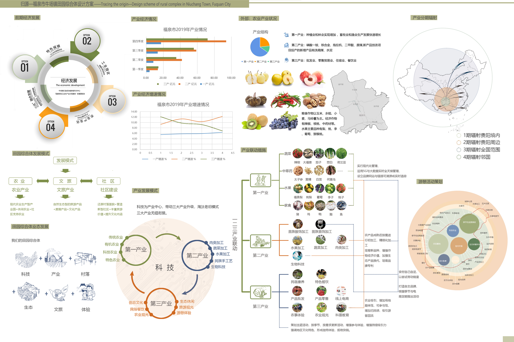
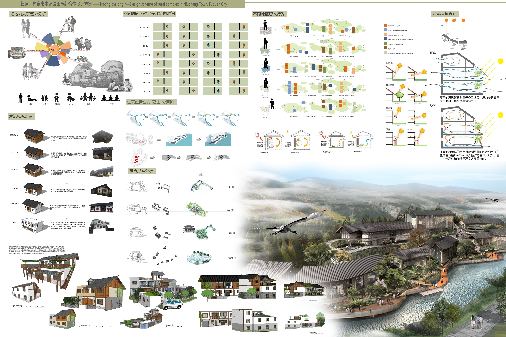

# 归源—福泉市牛场镇田园综合体设计方案 
- **投票数**：2721
- **作品编号**：ILIA-S-20208538
- **申报类别**：方案设计 - 园区景观设计
- **项目名称**：归源—福泉市牛场镇田园综合体设计方案
- **设计时间**：2020-06-11
- **项目地点**：贵州省福泉市牛场镇
- **项目规模**：1216910㎡

此图包括总平面图以及前期场地内外分析、政策解读、设计分析
## 设计说明

该方案选取贵州省黔南州苗族布依族自治州（福泉市）五子山地区这一具有苗疆文化特色的地块，根据现状调研及相关地域分析，决定通过三个层次逐级进行优化：第一层次为有效融合：对现有老旧建筑空间的整合，并结合场地植入游客体验活动——果蔬采摘、农家乐体验、自然科普教育等，构建一个集娱乐，生产，教育为一体的基地，构成居民与游客产生最大联系的生活状态。第二层次为文化建设：在保留原场地内的鼓楼和吊脚楼等古建筑基础上，依托旅游资源的特色民族风情小镇模式，在此片区域提供各种体验的可能性：苗岭飞歌、苗药体验、苗酿等。即“原住民、原生态，宜居住、宜商业，有就业、有税收”，既体现历史的传承性，维护村庄原有的生态和机理，又突出商业和旅游的发展，建设为宜居、宜业、宜游和充满生机与活力的“美丽家园”。第三层次为经济创收：创新“私家菜园”、“认领菜地”模式，即将露地、温室大棚划分成若干小块，城市消费者根据家庭人口数量认领一到几块地，再托管给农场。农场收取一定托管费对菜地进行管理，等菜地成熟后，每月按固定次数配送给客户。希望通过“移动互联网+认养参与”开启现代精致农业模式，颠覆传统农业种植模式，在移动互联网的潮流中，让传统农业焕发出新的活力。

通过分析国内外田园综合体发展及福泉市的产业发展政策，得出本设计互联网+的产业模式、发展方向、发展预期

通过对原场地生态的实地调查，提出针对性的修复与利用策略

通过对场地内部民居建筑的考察，结合场地位置、文化、产业等相关措施提出建筑保护与提升策略
## 设计感悟

本方案以农业产业为载体，结合村落改造、生态修复等更新设计，打造一个既能体现黔南地区苗族地域文化特色，又不单一的互动体验式田园空间设计。实现游人、居民、政府三者之间的有效融合：解决村寨风貌逐渐消失、城市居民对乡村田园的渴望等问题，实现大层次的国家“内循环”，小层次的场地“内循环”。
## 设计亮点

我们的设计利用有限的自然营造引起人对原始自然的共鸣——“继承传统，发扬创新”，在国家“内循环”推动下将乡村赋予景观与文化；因地制宜尊重生物安全，最大化提高三产创收，旨在实现“山清水秀、天蓝地绿、城在林中 、人在景中，打造了集吃、住、行、游、购一体的田园生态综合体”。
