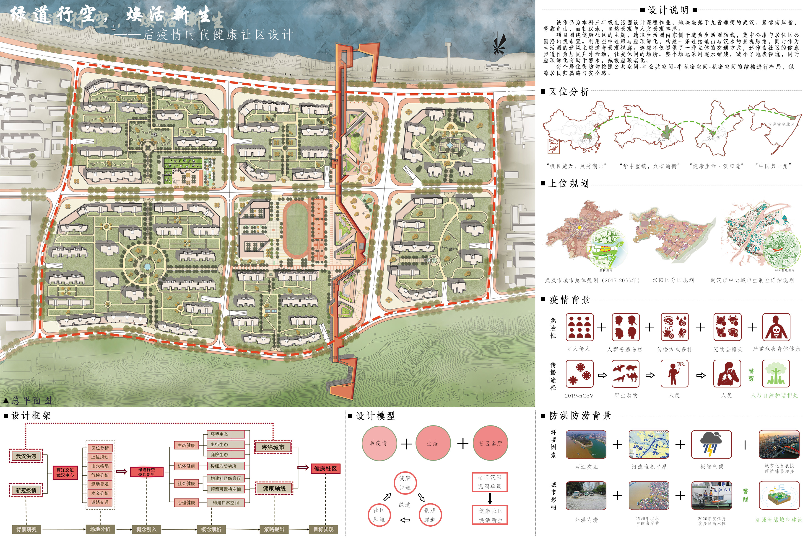
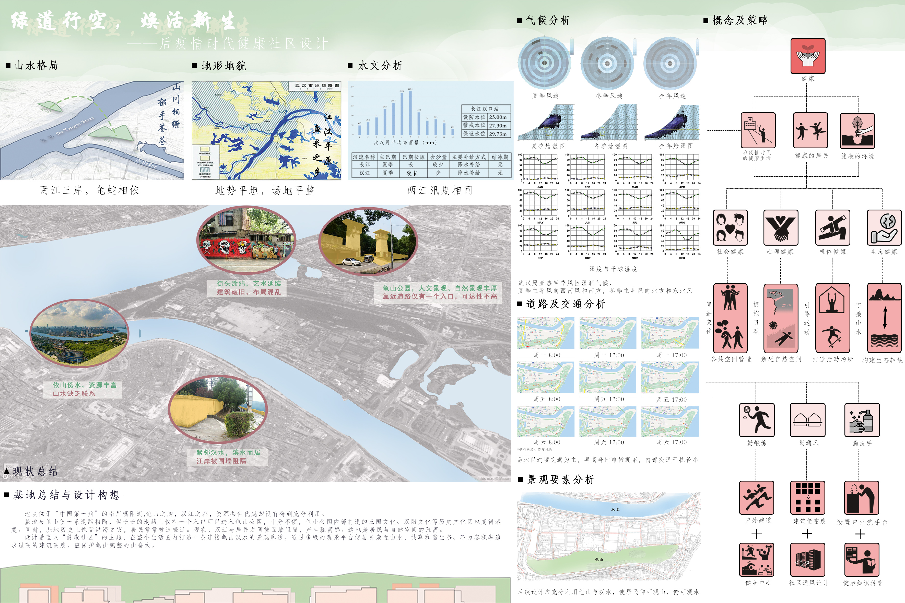
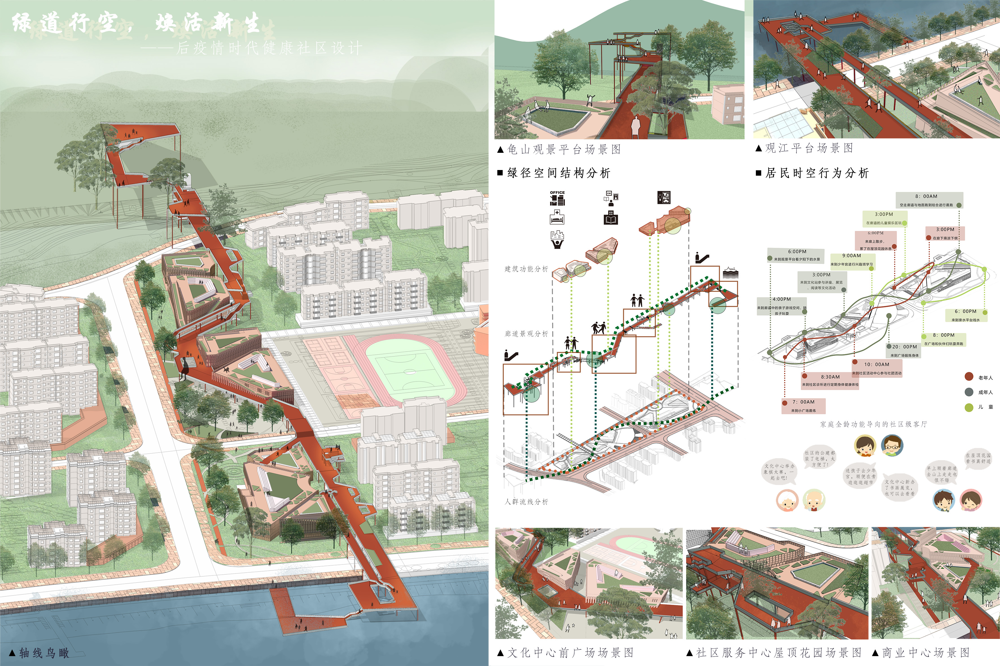
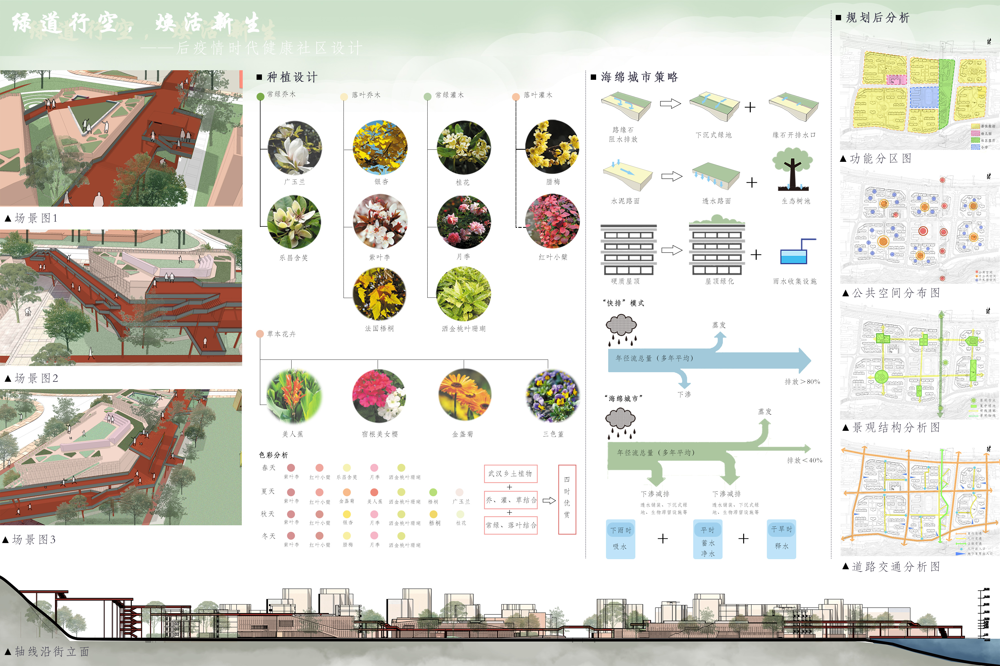

# 绿道行空，焕活新生——后疫情时代健康社区设计 
- **投票数**：1149
- **作品编号**：ILIA-S-20208550
- **申报类别**：方案设计 - 居住区环境设计
- **项目名称**：绿道行空，焕活新生——后疫情时代健康社区设计
- **设计时间**：2020-08-16
- **项目地点**：武汉
- **项目规模**：27.2公顷
## 设计说明

该作品为本科三年级的生活圈设计课程作业，地块坐落于九省通衢的武汉，紧邻南岸嘴，背靠龟山，面朝汉水，自然景观与人文景观丰厚。
项目围绕健康社区的主题，选取生活圈内东侧干道为生活圈轴线，集中公服与居住区公园沿轴线布置。利用空中连廊与屋顶绿化，构建一条连接龟山与汉水的景观脉络，同时作为生活圈的通风主廊道与景观视廊。连廊不仅提供了一种立体的交通方式，还作为社区的健康步道
每个居住街坊均按照公共空间-半公共空间-半私密空间-私密空间的结构进行布局，保障居民归属感与安全感。

设计概念与策略：以“健康社区”为主题，将健康分解为机体健康，心理健康，社会健康与生态健康四部分，在后疫情的时代背景下，从四个健康的角度探讨新的健康生活方式

1.空中连廊与周边公服共同组成社区主轴线，景观通廊，高可至龟山，低可近汉江，屋顶绿化形成的绿轴加强了山水联系
2.以“家庭全龄导向的社区客厅”为设计理念，通过多样的建筑功能与空间形式为不同年龄段的人群提供符合其年龄段的健康生活方式

1.种植多选择武汉本土植物，乔灌草，常绿落叶结合搭配
2.从沿街立面可以看出，建筑整体高度较低，是为了漏出完整的龟山山脊线
## 设计感悟

空中廊道上至龟山，北接汉水，加强了山水联系，多级的观景平台与观江平台使居民与自然更亲近，利于其获得心灵的沉静。廊道与周边的公建共同构成的“社区客厅”，具有丰富的建筑功能与空间形式，旨在促进各年龄层居民进行户外活动与社会交往，维护居民机体健康与社会健康。设计时同时考虑屋顶绿化与透水铺装维护生态健康。
## 设计亮点

生活圈的主轴线，即“社区客厅”是整个方案的亮点，其由贯穿社区，连接龟山与汉水的景观廊道和功能多样的集中公服共同组成。整个建筑群包括了社区服务中心，文化活动中心，商业中心等。屋顶花园，空中连廊，观景平台，亲水平台，架空灰空间等，为人们提供了丰富多样的空间形式，同时也提供了多样的，满足不同年龄段的公共社交场所。希望通过这条轴线，为整个区域吸引人气，带来活力，迎接新生。
