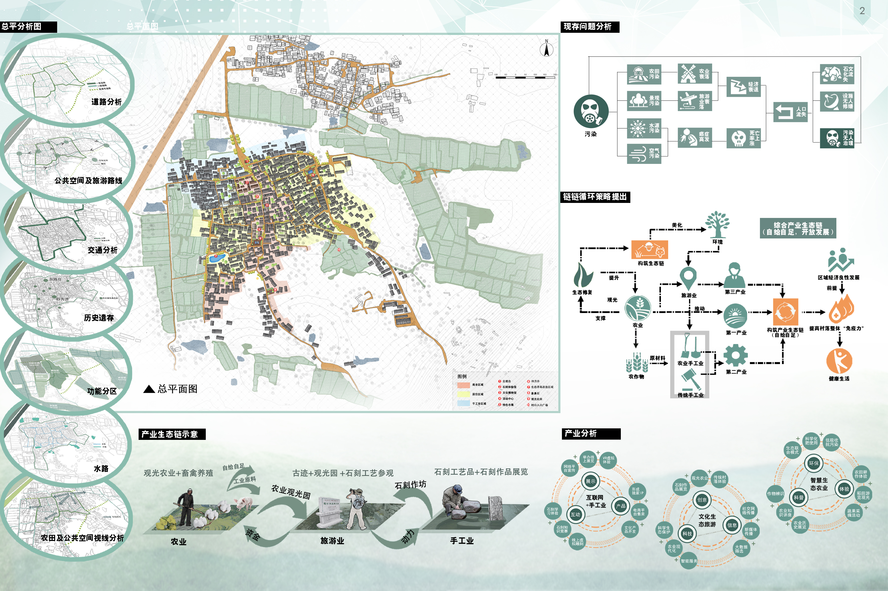
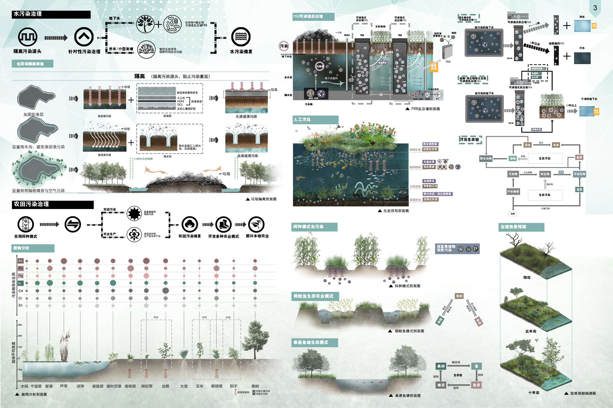

# 窦转鼎新——产业融合模式下的村落景观修复设计 
- **投票数**：2176
- **作品编号**：ILIA-S-20208575
- **申报类别**：方案设计 - 居住区环境设计
- **项目名称**：窦转鼎新——产业融合模式下的村落景观修复设计
- **设计时间**：2020-07-04
- **项目地点**：南京江宁区窦村
- **项目规模**：280000㎡

我们首先对设计场地地块的地理区位、文化历史特点、现存的各方面问题进行了深入了解和调研。
## 设计说明

设计背景：南京窦村历史悠久、文化积淀深厚，然而近年来的种种变化让村落走向衰落。周边城市发展使其空心化问题日益严重，村落周围的垃圾填埋场的使用更是严重影响了村民的日常生活，土壤污染导致植物难以生长，空气污染使村落充斥着难闻的气味，居民们为此苦不堪言。而且疫情影响下的村民生活也较为艰难，人们面临生活来源不足的问题。现在的窦村有着环境、文化、经济等诸多方面的困境。
设计目标：基于以上问题，我们将把改善窦村“生态链”、保护传承当地传统文化、发展当地经济并形成良好经济循环、让当地村民疫情期间可以实现自给自足作为目标。打造“实业石村”，让当地经济可以良性发展，让当地传统文化得以留存，让当地生态得以恢复。
设计策略：通过隔离、PBR技术、建立人工浮岛等方式治理周边环境污染，并梳理道路和交通，划分不同功能分区，将窦村打造为一个舒适、宜居的村落。在此基础上，发展农业、手工业、旅游业，带动经济增长并解决村落空心化问题。这些可以使游客体验道窦村独特的文化氛围和优良的生态环境，面对疫情，人们可以有稳定的生活来源，从而提高生活质量，实现健康生活。

对场地存在的各方面问题进行总结归纳，并提出结构性策略：营造自然生态链与产业生态链，链链融合，增强村落社会“免疫力”，打造良性循环、自给自足、健康生活的新型乡村

在生态修复方面，我们采用PRB可渗透反应墙的技术，利用植物+微生物联合修复的方法治理地下水污染；营造人工浮岛，利用浮岛生态链自我恢复的特性，清理村落周围池塘水污染；应用高富集植物+低吸收作物间种的方法去除农田污染；设计了多种生态农业模式，丰富农业景观，发展本地观光农业。

在针对村落的内部设计方面，我们首先对村落的道路进行了梳理规划，对村落整体进行功能分区；其次进行了建筑空间改良，并打造了四种不同功能类型的院落，开辟出专门的手工业空间，发展村落特有的石匠工艺；最后对村落主轴线上的公共空间进行了设计，精心营造出多个功能丰富多姿多彩的节点空间。由此，我们将村落的手工业、农业、旅游业进行了整合，形成了良性循环、自给自足的产业生态链。
## 设计感悟

南京窦村的改造将为当地注入新的生机，让面临“荒村”的窦村可以找到自己的发展方向，以及使村民们在疫情状况下拥有稳定生活来源。同时为那些面临生态问题的传统村落提供新的发展思路，对疫情影响下的村庄如何自足的问题也有着借鉴意义。
## 设计亮点

1．总用地面积：280000㎡
2．建筑基底面积：127000㎡
3．建筑面积：169300㎡
6．容积率：0.6
7．绿地率：75%
