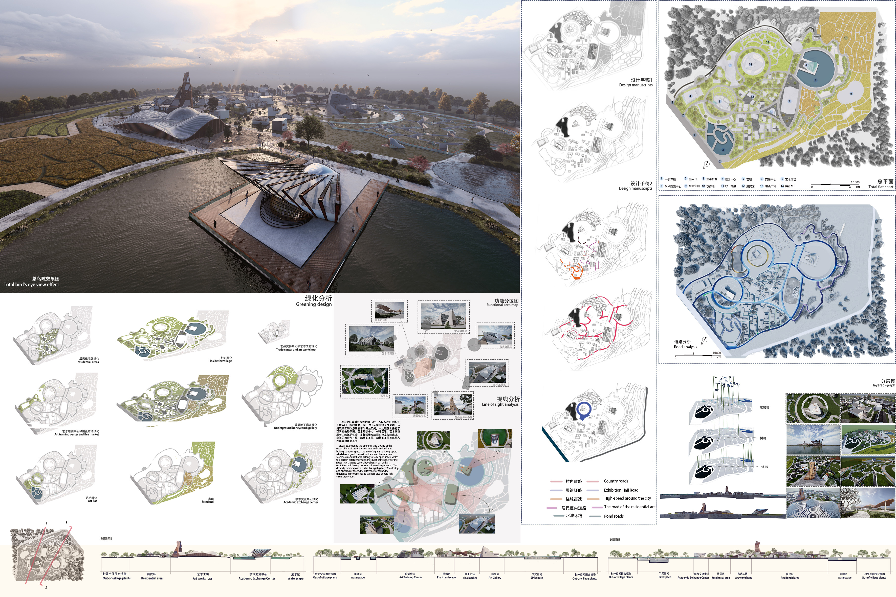
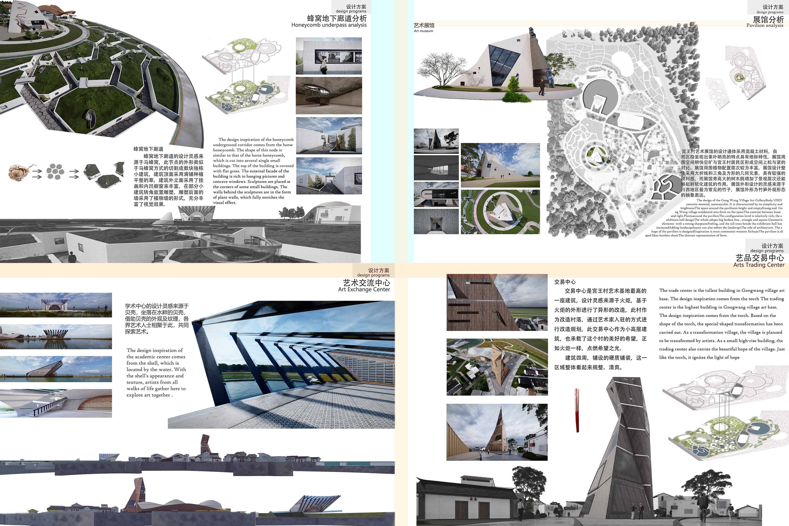

# 艺栖——成都市新都区宫王村景观空间规划设计 
- **投票数**：1220
- **作品编号**：ILIA-S-20208579
- **申报类别**：方案设计 - 城乡公共空间
- **项目名称**：艺栖——成都市新都区宫王村景观空间规划设计
- **设计时间**：2020-05-20
- **项目地点**：四川省成都市新都区宫王村
- **项目规模**：面积约23000㎡

文本内容包含总鸟瞰图，总平面图分析图，功能区景观绿化分析，大剖面图
## 设计说明

时代的进步，科技领域的提升，社会基建的完善，人口数量的增长，在这高速发展的信息时代中，自然村落开始逐渐减少，转变为商业中心，住宅小区等，一切都以高速发展经济效益为基础，提升土地价值提高其使用效率。自然村落在减少的过程中，减少的不只是土地，也包含着土地所孕育的自然资源与沉淀的历史文化。根据此次规划设计，以改造自然村落为项目，在这个过程中，此次将保留项目用地中原生的自然资源与发掘出的历史文化，并引入艺术文化进行有机整合的转变。

文版内容包含局部功能区规划设计，具有特点的独特建筑的外观设计与设计想法
## 设计感悟

本次项目设计，在保留原地貌及生态环境下，进行重新的土地资源有机整合以及空间与功能区规划，提高当地的生活质量，经济效益，新文化新血液注入提升活力。项目中的建筑设计大都为原创，在保持原创同时提供有用的实际效益以及创意，在考虑了当地的实际情况与未来的发展趋势进行了设计与融合规划，实现可持续发展。
## 设计亮点

1.建筑外观设计（学术交流中心，展览馆，交易中心，蜂巢下沉空间，艺术家作坊，培训中心，艺吧，跳蚤市场，居民建筑）
2.道路空间规划
3.重新整合的功能区规划
4.景观空间的规划设计
