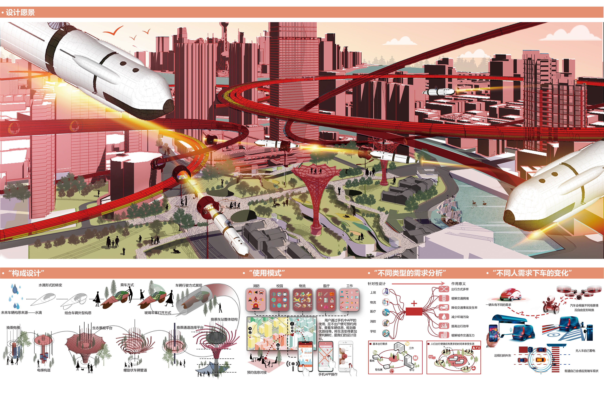

# 瞬息万变——上海市未来城市交通出行方式设计 
- **投票数**：2427
- **作品编号**：ILIA-S-20208672
- **申报类别**：方案设计 - 城乡公共空间
- **项目名称**：瞬息万变——上海市未来城市交通出行方式设计
- **设计时间**：2020-07-16
- **项目地点**：上海
- **项目规模**：1800公顷

## 设计说明

近年来，随着我国经济的不断发展，我国的城镇化进程也在不断加快，居民的出行需求一直呈现出持续增长的趋势，与此同时城市交通的拥堵情况不断加剧，出行的拥堵时间也在不断延长，拥堵路段更是不断增加，严重影响着人们的生活质量和对出行方式的选择。上海市有着庞大的经济总量和人口规模，市区人口密度更是位居全球前列，交通的营运规模、运载人次、行驶里程亦居世界首位，但交通拥堵、出行体验性差、环境污染等问题也在日渐严重。
未来的城市是什么样子的呢？我们年轻一代总是充满奇思妙想。本设计方案从设计目标和场地现状问题两个角度出发。根据前期调研得到的资料进行数据统计和整理分析。在认识到出行体验与人们的日常生活息息相关的同时，对上海未来的交通和出行方式提出畅想。致力于缓解城市交通拥堵的问题。
我们着重选择物流、医院 、消防、学校、上班这五个方面，通过构建地下跨区直达物流体系、智能居家健康监测与紧急医疗通道、地面升降防干扰消防道路、家校安全通学系统、大数据空中轨道交通等方案作为未来智能城市交通的重要部分。目的是为了缓解城市交通的压力，提高出行的实时性和便捷性，让人们享受瞬时生活的同时也为改善城市环境及生态健康发展做出自己的贡献。

## 设计感悟

项目经过大数据统计，及实地调查，从实际问题出发，大胆设想。致力于解决城市交通拥堵的问题。从市民的切身角度出发，通过构建地下跨区直达物流体系、智能居家健康监测与紧急医疗通道、地面升降防干扰消防道路、家校安全通学系统、大数据空中轨道交通等方案作为未来智能城市交通的重要部分。是未来出行方式的一大创新。
## 设计亮点

城市是人类文明的传承载体,是居民生产生活的向往家园.进城当市民过幸福生活,是中国农民的历史夙愿,而"堵车"则成为广受诟病的话题.发展智慧交通体系是节能减排的内在要求,是城市可持续发展的必然选择,也是大势所趋。本方案我们选择物流、医院 、消防、学校、上班这五个方面，通过构建地下跨区直达物流体系、智能居家健康监测与紧急医疗通道、地面升降防干扰消防道路、家校安全通学系统、大数据空中轨道交通等方案作为未来智能城市交通的重要部分。 是未来出行方式的一大创新。
